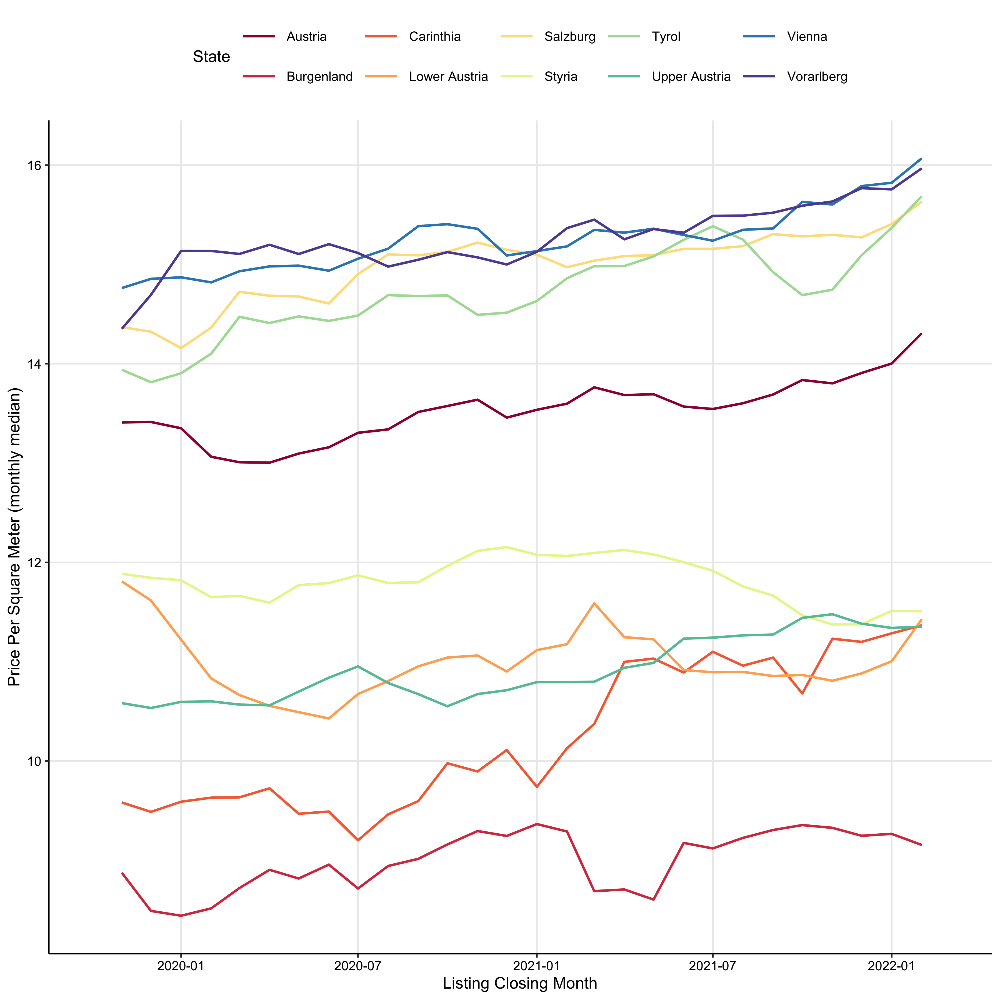
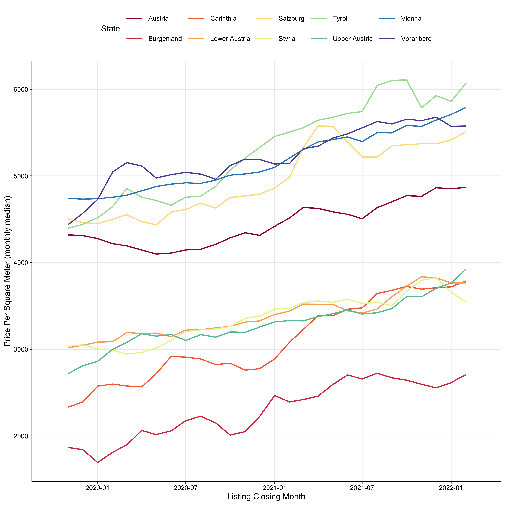
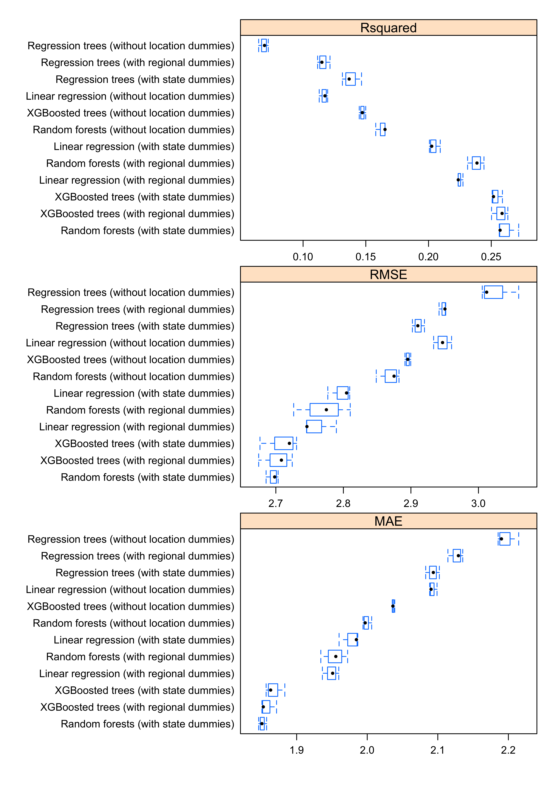
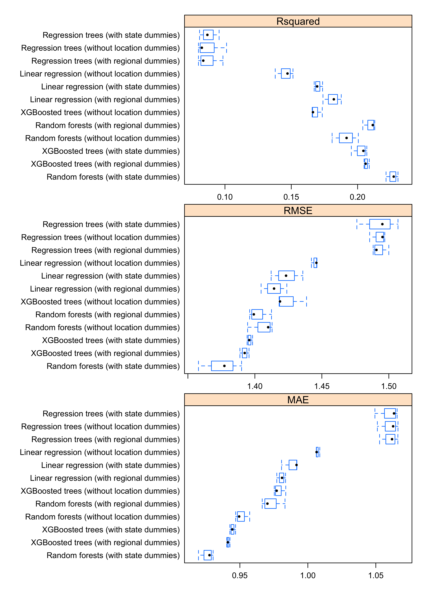

# Predicting the Demand for Real Estate Listings in Austria

## Abstract

Predicting the behaviour of the housing market has always been a challenging task of great significance since real estate affects the whole economy and individuals to a profound extent. This thesis explores the different aspects that impact the demand for real estate proper- ties, focusing on Austrian real estate listings advertised online on the platform ImmoScout24. The properties are mainly described by phys- ical characteristics such as the price, area or the number of rooms. These are the primary variables used in this research to predict the real estate demand measured as the number of users expressing inter- est in the given property through the platform. The secondary part of the research explores the macroeconomic factors that influence the housing market based on the available literature.
Machine learning methods are implemented for predicting the de- mand using four models: OLS regression, regression trees, random forests, and XGBoosted trees. Furthermore, different types of division regarding geographical hierarchy are specified in the models to see how well the details about the location contribute to the performance of the models.
The results suggest that random forests with Austrian states as the location specification perform the best in the purchase and rental segments. The crucial influences in the rental segment are the price per square meter and whether the listing was advertised privately. On the other hand, while the price per square meter also matters in the purchase segment, factors such as the online duration of the listing and the Covid 19 pandemic appeared to play a substantial role in this segment.

Keywords — housing demand, real estate, Austria, machine learning

## Development of median prices over time among Austrian states

Rent segment (3-month moving average) | Purchase segment (3-month moving average)
--- | ---
 | 

## Comparison of the final models

Rent segment | Purchase segment
--- | ---
 | 

## Non-disclosure agreement

Since this bachelor thesis was written under non-disclosure agreement, the code, results, and further details of the research cannot be shared publicly. However, I am happy to share the methodology and the models used in the thesis if requested. Moreover, I could possibly share code snippets as well.
